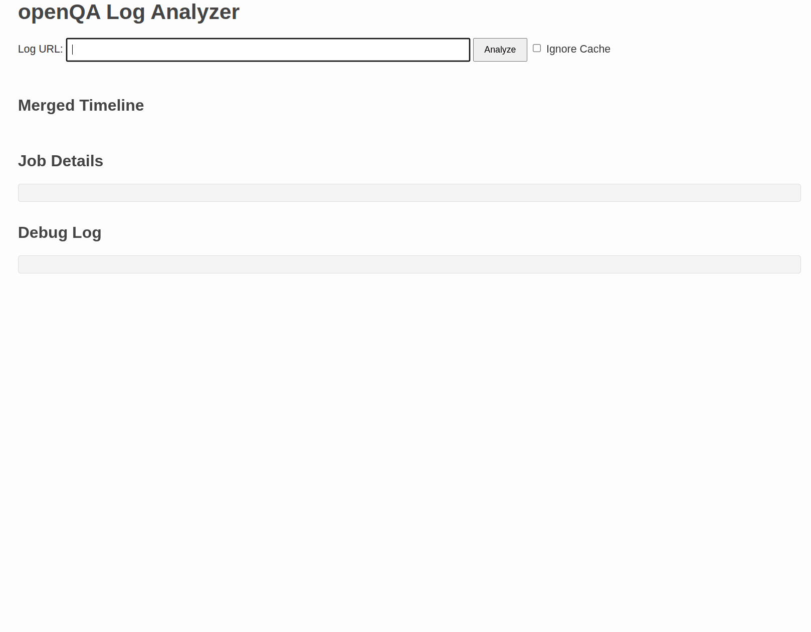

# openQA Log Visualizer

A web-based tool to analyze and visualize logs from multiple, related openQA jobs. It automatically discovers parallel jobs, parses their logs for key events, and merges them into a single interactive timeline, making it easier to debug complex multi-machine test scenarios.



## The Problem

Debugging race conditions, deadlocks, and other synchronization issues in parallel openQA jobs is challenging. It often requires manually opening multiple `autoinst-log.txt` files and cross-referencing timestamps to understand the sequence of events across different machines.

This tool automates that process by:
1.  Automatic exploring the jobs dependency tree.
2.  Fetching a job and all of its parallel parent/child jobs.
3.  Parsing their logs according to flexible, user-defined rules.
4.  Presenting a unified, visual representation of the entire test suite on a single interactive timeline.

## Key Features

*   **Interactive Timeline:** Merges and visualizes key events (like mutex locks, barrier waits, and errors) from all related jobs on a single, zoomable timeline.
*   **Automatic Job Discovery:** Given a single openQA job URL, it automatically discovers and fetches data for all parent and child jobs in the parallel test suite.
*   **Configurable Log Parsing:** Uses a flexible `config.yaml` to define custom regular expressions for extracting relevant events.
*   **Dynamic Data Display:** The "Job Details" table columns are generated dynamically based on the actual data parsed from the logs, ensuring it adapts to different test types.
*   **Click-to-Highlight:** Clicking an event on the timeline scrolls to and highlights the corresponding line in the detailed log view.
*   **Performance Caching:** Caches job details and log files to speed up subsequent analyses of the same jobs.
*   **Debug Panel:** Provides a detailed debug log of the analysis process itself for troubleshooting the tool.

## Installation and Setup

### Prerequisites

*   Python 3.9 or newer
*   [uv](https://github.com/astral-sh/uv) - An extremely fast Python package installer and resolver. Please refer to its official documentation for installation instructions.

### Installation

1.  **Clone the repository:**
    ```bash
    git clone <your-repository-url>
    cd openqa-log-visualizer
    ```

2.  **Python dependencies:**
    This project uses `uv` to manage dependencies, which are listed in the `pyproject.toml` file. `uv` will handle the creation of a virtual environment and the installation of dependencies automatically. This means you do not need to use pip to create a virtual environment. Just run the application using `uv run` as explained below.


## Configuration

The core of the log parsing logic is controlled by the `config.yaml` file. This file allows you to define different "parsers," each with its own set of regular expressions ("channels") to extract specific events from `autoinst-log.txt` files.

The application matches a job to a parser based on its name and then uses the channels within that parser to find and categorize important log entries.

For detailed information on the structure of `config.yaml`, how to define parsers, and best practices for writing effective regular expression patterns, please refer to the **Configuration Documentation** (TBD).

## Usage

1.  **Start the server:**
    From the root of the project directory, run the application using `uv` and the
    Flask CLI.
    ```bash
    uv run flask --app app.main run --debug
    ```
    The first time you run this command, `uv` will automatically create a
    virtual environment and install the required packages. The `--debug` flag
    enables the reloader and debugger.

2.  **Open the application:**
    Navigate to `http://127.0.0.1:5000` in your web browser.

3.  **Analyze a Job:**
    Paste the full URL of an openQA job into the input field and click "Analyze". The application will fetch the job, discover its relatives, and render the timeline and details.

4.  **Interact with the UI:**
    For a detailed guide on how to use the web interface and interpret the results, please see the **Usage Guide**.

## Project Status
## Testing

This project includes both backend and frontend tests.

### Backend Tests

The backend tests are written using `pytest`. To run them:

```bash
uv run pytest tests/backend/
```

### Frontend Tests

The frontend unit tests are written using `Vitest`. They require Node.js to be installed.

To install dependencies and run the tests, you can use the provided Makefile:

```bash
make test-frontend
```

This project is currently a **Proof of Concept (PoC)** and is under active development. It should be considered a work-in-progress.

While the core functionality is in place, the tool is not yet considered stable for production use. Feedback and contributions are highly welcome to help shape its future direction.

## Contributing

Since this is a proof-of-concept, your feedback is the most valuable contribution you can make right now! I'm especially interested in hearing your thoughts on:

*   **New Features:** What would make this tool a must-have for your daily work?
*   **Usability:** Is the timeline easy to use? Is anything confusing?
*   **Documentation:** Is this README clear? What's missing?

The best way to share your thoughts is by [opening an issue on GitHub](CONTRIBUTING.md#providing-feedback).

Of course, if you're inspired to write some code, pull requests are also welcome! Please see our [**Contributing Guidelines**](CONTRIBUTING.md) for more details.

## License

This project is licensed under the **GNU General Public License v2.0**. See the [LICENSE](LICENSE) file for the full license text.