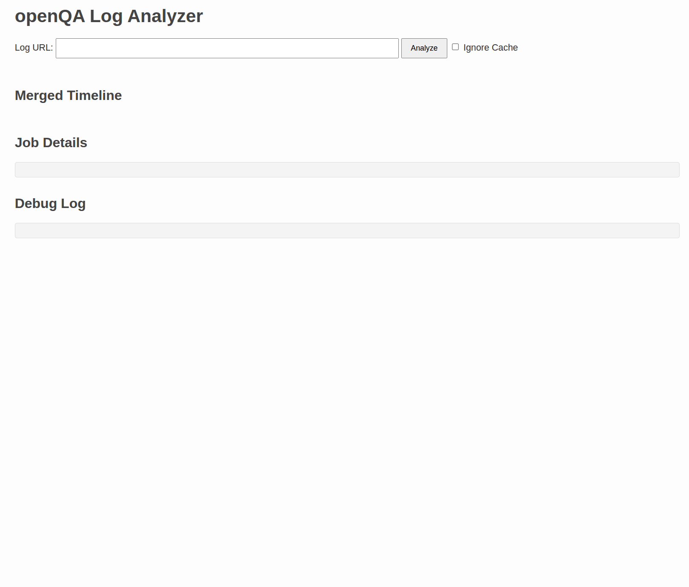
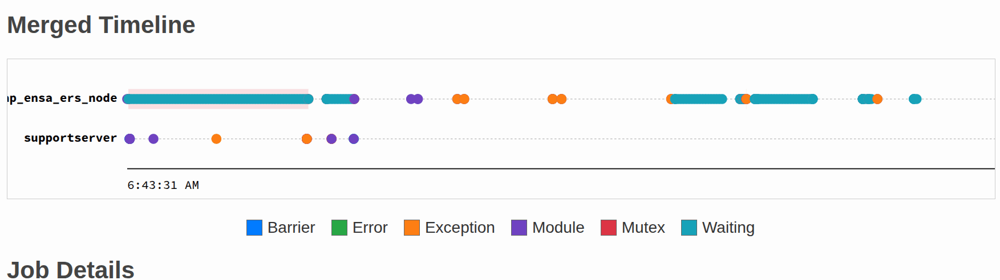

# Using the openQA Log Visualizer

This guide explains how to use the features of the openQA Log Visualizer web interface to analyze and understand complex, multi-machine openQA test runs.

## 1. Starting an Analysis

To begin, you need to provide the URL of an openQA job.

* **Log URL Input**: Paste any URL from an openQA job's page, like the link to a log file or the main test details page. The tool is smart enough to extract the necessary information (like the server hostname and job ID) from a standard openQA URL.
  * *Example URL*: `https://openqa.opensuse.org/tests/5277830`

* **Analyze Button**: Once you've entered the URL, click the "Analyze" button to start the process.

* **Ignore Cache Checkbox**: By default, the application caches the results of an analysis on your disk to speed up subsequent requests for the same job. The application only caches results for jobs that are in a "done" state. If you want to force a fresh analysis and bypass the cache (e.g., if the job has been re-run), check this box before clicking "Analyze".

## 2. While You Wait

After you start the analysis, the "Job Details" section will display an "Analyzing..." message. The process involves:

1. Fetching details for the initial job ID.
2. Discovering and fetching all related parent and child jobs.
3. Downloading the `autoinst-log.txt` for each job.
4. Parsing the logs to find key events.
5. Merging all events into a unified timeline.

This can take anywhere from a few seconds for cached results to a minute or more for complex test suites with many jobs and large logs.

## 3. Navigating the Results

Once the analysis is complete, a floating navigation box will appear in the top-right corner of the page to help you navigate the results:

* **Expand/Collapse All**: Toggles all the collapsible sections within the "Job Details" area. This is useful for quickly viewing or hiding all the detailed information at once.
* **↑ Top**: Smoothly scrolls the page back to the top.

## 4. Understanding the Output

The results are presented in three main sections: the Merged Timeline, Job Details, and the Debug Log.

### Merged Timeline

This is the most powerful feature of the tool. It provides a single, interactive timeline visualizing the sequence of key events and synchronization patterns across all discovered jobs.

* **Lifelines**: Each horizontal line represents a single job, identified by its short name.

#### Visual Elements

The timeline uses several visual elements to represent different activities:

* **Event Circles**: These represent key events parsed from the logs. The color of the circle corresponds to the event `type` defined in `config.yaml` (e.g., `mutex`, `barrier`, `error`). Hover over a circle to see a tooltip with its exact timestamp, job name, and log message.
* **Critical Section Rectangles**: Red rectangles highlight the duration of a `mutex lock`/`unlock` pair, representing a critical section. If a lock spans two different jobs, parallel rectangles will be drawn on both lifelines. Hover over a rectangle to see a tooltip showing the name of the mutex.
* **Synchronization Arrows**: These represent point-in-time signals between jobs. They are color-coded to match the event type that generates them (e.g., a blue arrow for a `mutex` signal, a green arrow for a `barrier` signal). These arrows are hidden by default and appear when you hover over a related event.

#### Interactive Features

* **Hover-to-Trace**: Hovering your mouse over any event circle that is part of a synchronization (like a `mutex lock` or `barrier wait`) will instantly highlight the entire interaction. Unrelated events will fade out, and the corresponding arrows or critical section rectangles will become visible, showing you the complete start-to-end flow of the synchronization.
* **Tooltips**: As mentioned, hovering over event circles and critical section rectangles will display tooltips with specific details. The event circle's tooltip has priority, ensuring you can always inspect an event even if it's inside a rectangle.
* **Click-to-Highlight**: Click on any event circle. The page will automatically expand the relevant job's "autoinst-log" section and scroll to highlight the corresponding log entry. This is the primary way to correlate a high-level event on the timeline with the specific log line that generated it.
* **Zooming**: Click and drag horizontally across a section of the timeline to zoom in on that specific time range. A "Reset Zoom" button will appear, allowing you to return to the full view.

#### Dynamic Legends*

* **Event Legend**: Below the timeline, a legend dynamically displays all the event types found in the logs and their corresponding colors.
* **Synchronization Legend**: This special legend appears only when you are hovering over a synchronization event. It explains the meaning of the different arrows and rectangles, providing context exactly when you need it.

### Job Details

This section contains the detailed information for each job that was part of the analysis.

* **Job Header**: Each job has a header that includes:
  * The **Job ID**, which is a direct link to the job's page on the openQA server.
  * A **short name** for the job, extracted from the full name using the `match_name` regex in the configuration.
  * The name of the **Parser** from `config.yaml` that was used to process the log.
  * A **[Cached]** indicator if the data was loaded from the local cache.

* **Collapsible Sections**: Below the header, details are organized into collapsible sections:
  * **Settings**: A table of the job's settings from openQA.
  * **autoinst-log**: A table of the parsed log entries. This is not the full log, but only the lines that matched the patterns defined in the active parser's channels.
  * **Exceptions**: If any Perl exceptions were found in the log, they are listed here in their entirety.
  * **Other Details**: A raw JSON view of all other metadata fetched for the job.

* **Log and Exception Linking**: The `autoinst-log` and `Exceptions` sections are linked.
  * In the `autoinst-log` table, exception messages are summarized. Clicking on the summary message (which is a link) will jump you to the full exception text in the `Exceptions` section.
  * In the `Exceptions` section, each exception has a `[Go to log line]` link that will take you back to its summary line in the `autoinst-log` table.

### Debug Log

At the very bottom of the page, this box shows a detailed log of the backend analysis process. It includes information about which jobs were fetched, cache hits/misses, and any errors that occurred. It is primarily useful for troubleshooting the visualizer tool itself.
